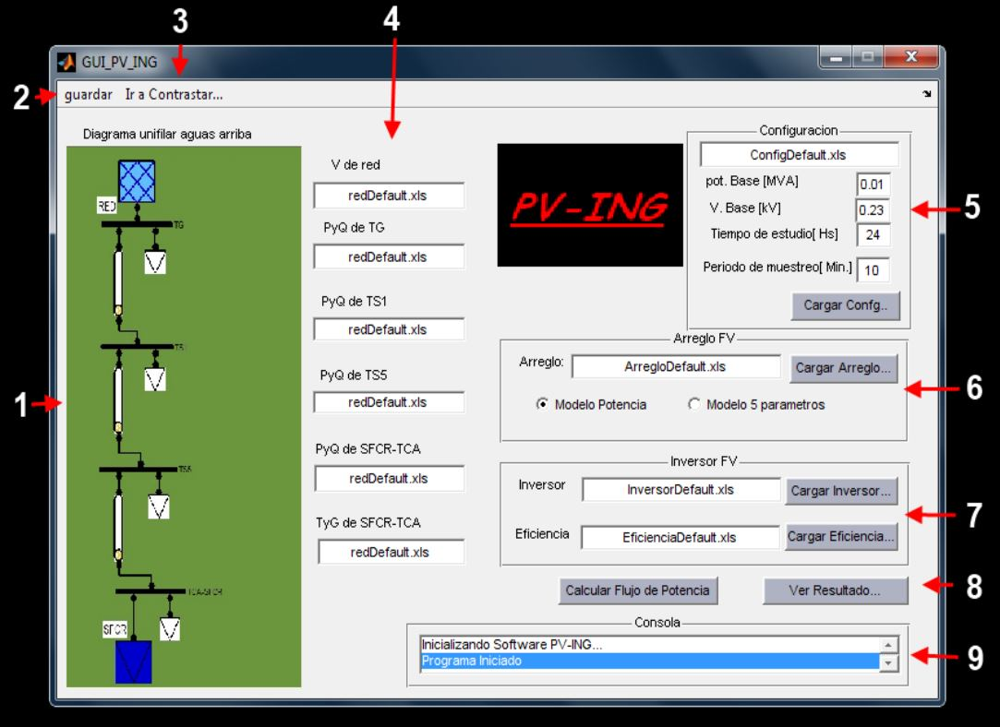
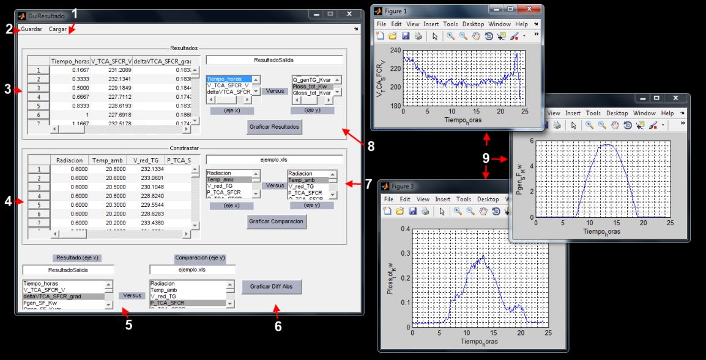
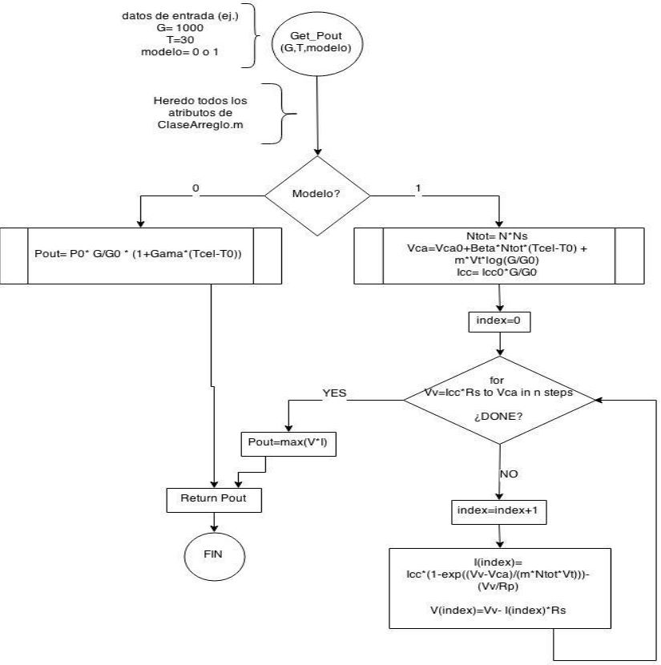
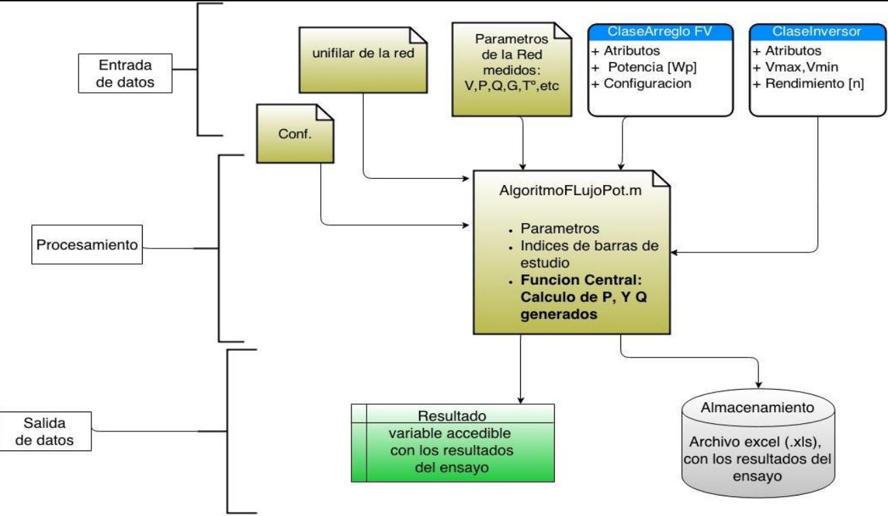
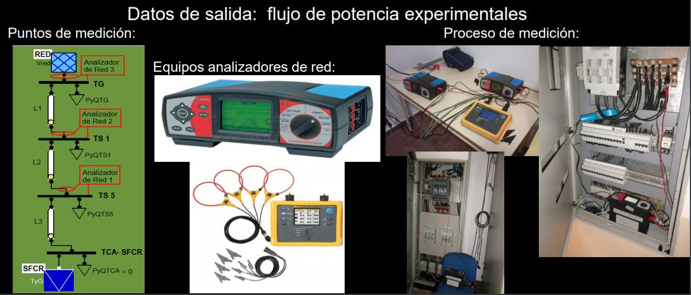
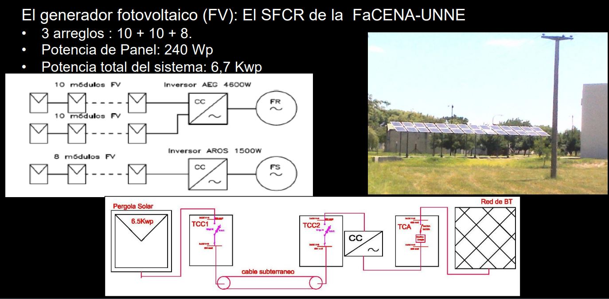

# Modelo computacional para evaluar la inserción de fuentes fotovoltaicas en el sistema de distribución eléctrico urbano.

Se desarrollo un Modelo computacional y matematico de procesamiento de datos, para validar la inserción de generación fotovoltaica de manera distribuida (conectada a red) en instalaciones domiciliarias. 

### Vistas del Front End 

### Algoritmo matematico 

### Diagrama de clases del software

### validación del modelo con datos reales

---

## Justificación del modelo 

Reducir las emisiones de efecto invernadero es una prioridad de primer orden mundial.

En el contexto local, Argentina tiene otras urgencias en el ámbito energético:

+ Diversificar su matriz de generación.
+ Ampliar la capacidad de las redes de distribución.
+ Mejorar la calidad del servicio y calidad del producto eléctrico.

En el ámbito urbano de trabajo (la ciudad de Corrientes), las urgencias son las
mismas, incluyendo además:
+ Falta de planeamiento y obras de expansión en distribución de MT y BT.
+ Falta de mantenimiento preventivo y paliativo en redes existentes.

Por las razones nombradas se requieren exhaustivos estudios para planificar la inclusión de SFCR distribuidos en la red eléctrica y su correcto planeamiento en sistemas eléctricos de potencia. 
Por lo tanto, el desarrollo de modelos matemáticos , software y simulaciones, son fundamentales para la planificación y análisis de las redes con inclusión de SFCR.

En este sentido se limito el desarrollo realizado a la siguiente red y SFCR:
+ Red: red de Baja tensión del nuevo edificio de ingeniería, FaCENA-UNNe
+ Sistema: SFCR Monofásico de 6,7kWp (ubicado en el nuevo edif. FaCENAUNNE)

---
## Conclusiones 
El adecuado diseño y validación de distintos modelos matemáticos complejos, permiten
simular, evaluar y predecir las consecuencias de la inclusión de un SFCR en la red de
baja tensión local, orientándonos a un horizonte de la matriz energética con generación
no convencional.
Se determinó que la mala calidad de potencia del servicio de la red de BT local (esto
incluye: bajos niveles de tensión, alta taza de cortes), sumado a que el diseño de la
instalación eléctrica original del edifico no se contempló un SFCR (lo cual género, en
horas de bajo consumo, efectos de alta tensión en las barras del SFCR). Disminuyen la
calidad y cantidad de energía que el SFCR puede suministrar (Caceres, 2013).
Por los motivos expuestos se concluyó que el software diseñado permite modelar y
aproximarse a los porcentajes de energía no suministrados por el SFCR, debido
exclusivamente al mal desempeño de la red de BT.
El software modelado, diseñado y validado, presenta gran flexibilidad de adaptación y
crecimiento, lo cual permite una rápida inclusión de mejoras y extensiones de
funcionalidad del mismo. Además de poseer una interfaz grafica sencilla y amigable